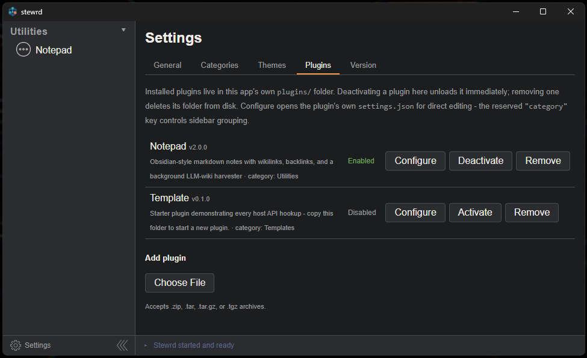

# Stewrd

In the age of AI, it's never been easier to spin up a custom one-off app to do exactly what you want. The problem is that habit leaves you with a pile of disconnected, one-off tools that all look and behave differently. Stewrd consolidates that instinct into a single host app: instead of a new standalone app every time, you build a plugin that follows one set of standards and slots into the same shell, sidebar, theming, and layout system as everything else you've made.
  

  
A personal, cross-platform (Windows/macOS/Linux) desktop app whose functionality is delivered almost entirely by **hot-loadable plugins**. The host app is a shell — a sidebar of installed plugins grouped by category, a main content area split into resizable panes so multiple plugins can be visible at once (dashboard-style, with saveable/recallable named layouts), and a status bar for logs/errors.
 
## Features

- Hot-loadable plugins — trusted, unsandboxed JS/TS bundles with full shell/filesystem/storage access through a host-provided API
- Marketplace plugin — browse a community plugin catalog and install/update entries with one click, no git or GitHub account needed
- Split-pane, dashboard-style layout with saved/recallable named layouts
- Theming — switch between premade or custom color palettes, applied live across the host and every plugin
- Self-updating (checks GitHub Releases, downloads and verifies signed updates)

### Planned
- macOS and Linux support
- Additional integrated LLMs

## Tech stack

Tauri 2 (Rust backend) + React 19 + TypeScript + Zustand, plugin bundles built with esbuild.

## Getting started

Download a prebuilt release from the [Releases page](../../releases) (Windows/macOS/Linux installers), or build from source:

```sh
npm install
npm run plugin:build -- plugins/_template   # dist/ is gitignored — build each plugin at least once
npm run plugin:build -- plugins/notepad
npm run plugin:build -- plugins/marketplace
npm run tauri dev                            # full app in dev mode
npm run tauri build                          # packaged app for the current OS
```

## Creating plugins

Open a terminal in your Stewrd app folder's `plugins/` subfolder, launch an AI coding assistant (e.g. Claude Code), and just ask it to make a plugin — describe what it should do. `plugins/` ships with its own `CLAUDE.md` (plus a root-level [ARCHITECTURE.md](ARCHITECTURE.md) for full host internals) and a working `_template` plugin to copy from — it's enough context for the assistant to build whatever plugin you describe without extra hand-holding. Building requires [Node.js](https://nodejs.org/); `plugins/CLAUDE.md` walks through the one-time `npm install esbuild` setup.

Plugins are portable and shareable: zip up a plugin's folder, hand the zip to someone else (or move it to another machine), and they can load it straight into their own Stewrd install.

For the full plugin API, lifecycle, and host internals, see [ARCHITECTURE.md](ARCHITECTURE.md).
   
---
  
<div align="center">

[](https://ko-fi.com/O0G227OHN1)

</div>

## License

Stewrd is source-available under the [Business Source License 1.1](LICENSE). Free to use, copy, modify, and self-host — including commercially. The only restriction: you can't sell, resell, or host it (or a modified version) as a competing product/service.

Donations are welcome and appreciated if you find this useful — see the ko-fi button above.
